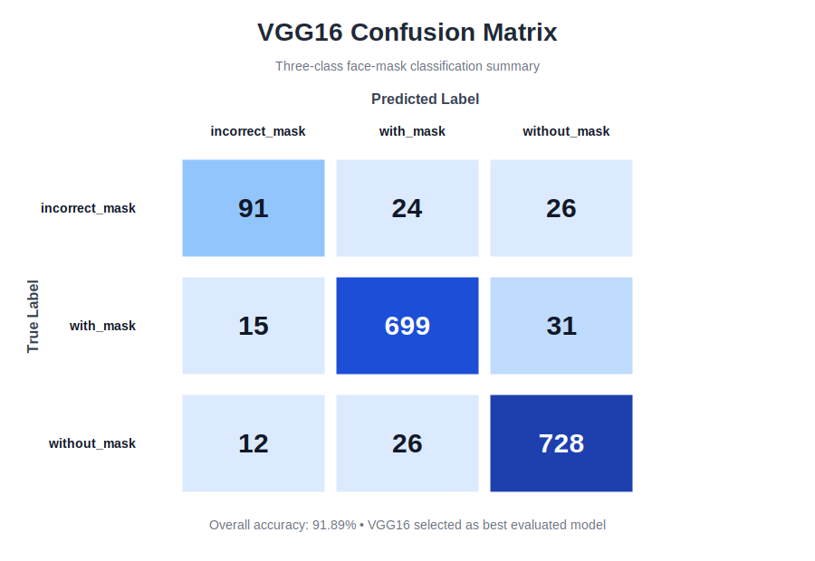
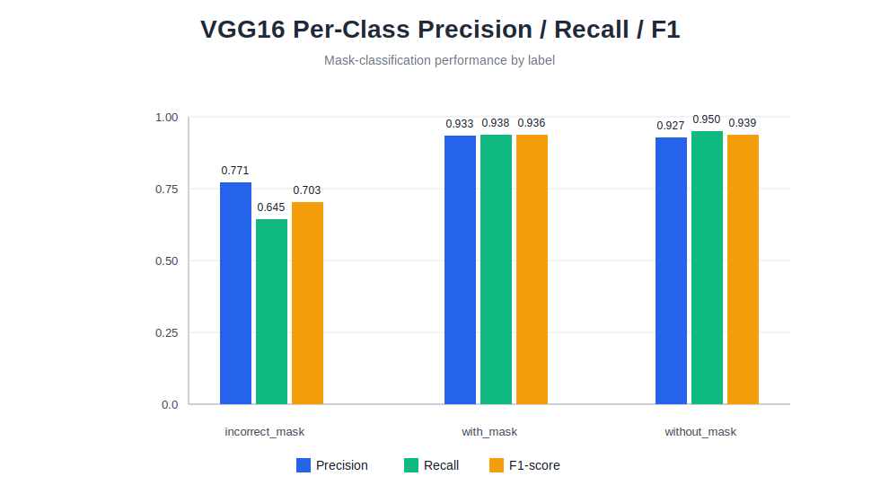
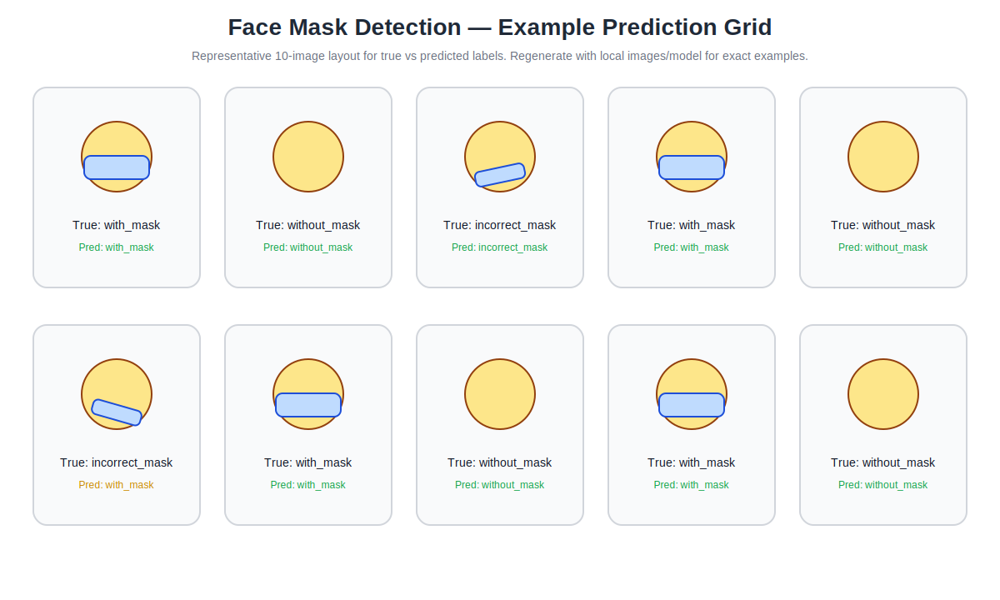

# Face Mask Detection with Transfer Learning

Computer vision project comparing pretrained convolutional neural network backbones for three-class face-mask classification.

## Overview

The workflow classifies images into:

- **With mask**
- **Without mask**
- **Mask worn incorrectly**

The analysis uses transfer learning with **EfficientNetB0**, **ResNet50**, and **VGG16**. Images are standardized to 128 × 128 × 3, loaded with Keras image generators, and evaluated on a held-out test set.

## Model Comparison

| Backbone | Test accuracy | Test loss | Rank |
| --- | ---: | ---: | ---: |
| VGG16 | **91.89%** | 0.2463 | 1 |
| ResNet50 | 60.29% | 0.8040 | 2 |
| EfficientNetB0 | 50.91% | 0.9212 | 3 |

**VGG16 was the strongest evaluated model at 91.89% test accuracy.**

## VGG16 Classification Summary

| Class | Precision | Recall | F1-score | Support |
| --- | ---: | ---: | ---: | ---: |
| incorrect_mask | 0.771 | 0.645 | 0.703 | 141 |
| with_mask | 0.933 | 0.938 | 0.936 | 745 |
| without_mask | 0.927 | 0.950 | 0.939 | 766 |
| weighted avg | 0.916 | 0.919 | 0.917 | 1,652 |

The strongest model performs very well on the two larger classes and has more opportunity for improvement on the smaller **incorrect_mask** class.

## Evaluation Visuals

### Confusion Matrix



### Per-Class Metrics



### Prediction Examples



## Repository Structure

```text
.
├── .github/workflows/ci.yml
├── app.py
├── data/
│   └── processed/
│       ├── model_comparison.csv
│       ├── vgg16_classification_report.csv
│       └── vgg16_confusion_matrix.csv
├── figures/
│   ├── per_class_metrics.svg
│   ├── prediction_examples.svg
│   └── vgg16_confusion_matrix.svg
├── notebooks/
│   └── face_mask_transfer_learning_analysis.ipynb
├── scripts/
│   └── generate_evaluation_artifacts.py
├── src/
│   ├── __init__.py
│   ├── evaluation.py
│   └── models.py
├── tests/
│   ├── test_evaluation.py
│   └── test_project_structure.py
├── DATA_ACCESS.md
├── LICENSE
├── README.md
└── requirements.txt
```

## Technical Approach

The project applies frozen pretrained CNN feature extractors followed by `GlobalAveragePooling2D`, dropout, and a three-neuron softmax classification head. Training uses Adam, categorical cross-entropy, early stopping, and learning-rate reduction on validation-loss plateaus.

## Streamlit Inference Demo

The repository now includes a local Streamlit demo for model review and image inference. Because trained model weights and the full image dataset are intentionally excluded from Git, the app accepts a locally trained `.keras` or `.h5` model upload.

```bash
streamlit run app.py
```

## Regenerate Evaluation Artifacts

After placing local data and saving prediction outputs, run:

```bash
python scripts/generate_evaluation_artifacts.py --predictions data/processed/predictions.csv
```

Expected prediction CSV columns:

```text
true_label,predicted_label
```

## Run Locally

1. Clone the repository.
2. Create and activate a Python virtual environment.
3. Install dependencies with `pip install -r requirements.txt`.
4. Follow `DATA_ACCESS.md` to place the image data locally.
5. Open `notebooks/face_mask_transfer_learning_analysis.ipynb` in Jupyter.
6. Run `python -m pytest -q` to validate the reusable utilities.
7. Run `streamlit run app.py` to launch the inference demo.

## Portfolio Relevance

This project demonstrates transfer learning, multiclass image classification, comparative model evaluation, training diagnostics, confusion-matrix interpretation, per-class precision/recall/F1 analysis, a lightweight inference interface, and the translation of an experimental notebook into a structured, testable repository.

## Responsible Use

This is a portfolio computer-vision project, not a medical, legal, or workplace-compliance system. Performance should be revalidated on representative deployment data before any real-world use.
